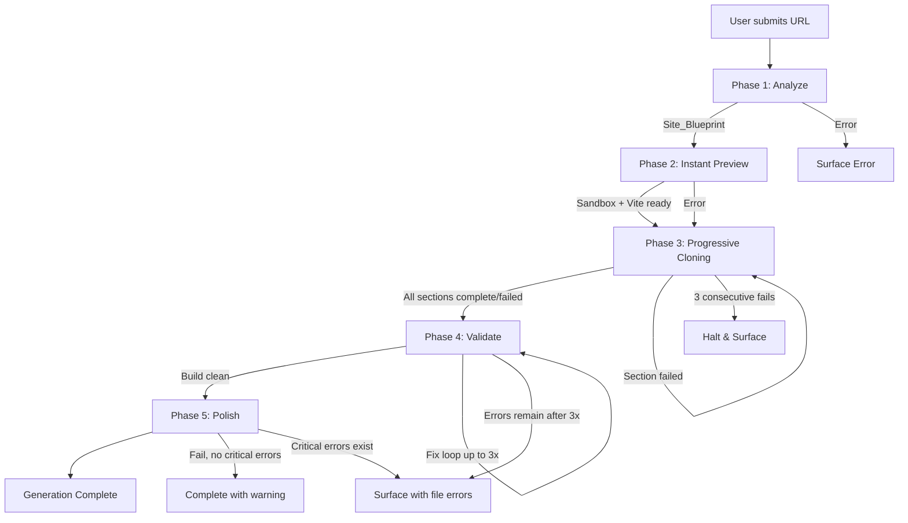
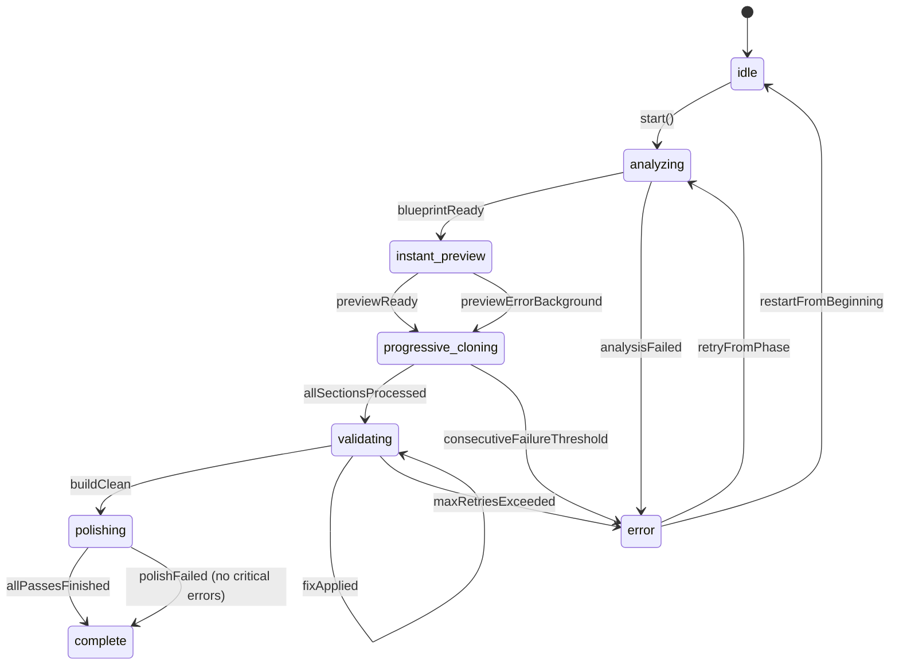

# Design Document: Progressive Generation Architecture

## Overview

MirrorSite AI currently clones websites through a monolithic single-pass pipeline: it scrapes a URL, calls an AI once to generate all code, writes every file, and only then shows the user a preview. This produces an 80–170 second wait with no feedback and catastrophic failure modes — a single broken file forces full regeneration.

The Progressive Generation Architecture replaces that pipeline with five sequential phases:

```
Analyze → Instant Preview → Progressive Cloning → Validate → Polish
```

Each phase is independently executable, logged, and recoverable. The user sees a working preview in under 30 seconds; individual sections fill in as they complete; build errors are patched surgically without touching working sections.

Key design goals:

- **Time-to-first-pixel under 30 seconds** via the Instant Preview phase
- **Progressive, section-by-section delivery** with visible progress
- **Targeted error recovery** — fix only what broke, never regenerate everything
- **Zero regression** on the existing chat-based edit flow
- **Full observability** with per-phase logs, timestamps, and token accounting

### System Context

The application is a Next.js 14 application using the Vercel AI SDK for streaming generation. Sandboxes are isolated execution environments (E2B or Vercel) managed through the existing `SandboxProvider` abstraction. The new architecture builds directly on existing infrastructure: `SandboxProvider`, `sandboxManager`, `build-validator.ts`, `file-parser.ts`, and `morph-fast-apply.ts` are extended rather than replaced.

---

## Architecture

### High-Level Flow



### Phase State Machine

The pipeline exposes a strict state machine. Only the transitions shown below are legal.



States: `idle | analyzing | instant_preview | progressive_cloning | validating | polishing | complete | error`

### Component Map

```mermaid
graph LR
    subgraph "Next.js API Routes"
        GEN[/api/generate-ai-phase]
        APPLY[/api/apply-ai-code-stream extended]
        ORCH[/api/generation-pipeline]
    end

    subgraph "Core Services (lib/)"
        PSM[PhaseStateMachine]
        BPP[BlueprintParser]
        FPS[ProgressiveFileApplicationService]
        PPC[PriorityPhaseController]
        BV[BuildValidator extended]
        PP[PrettyPrinter]
        FP[FileParser extended]
    end

    subgraph "Existing Infrastructure"
        SBM[sandboxManager]
        SBP[SandboxProvider]
        MFA[morph-fast-apply]
    end

    subgraph "UI"
        UI[generation/page.tsx]
        PUI[ProgressUI component]
    end

    GEN --> PSM
    ORCH --> PSM
    PSM --> BPP
    PSM --> FPS
    PSM --> PPC
    PSM --> BV
    FPS --> SBP
    PPC --> SBP
    BV --> MFA
    APPLY --> FPS
    UI --> ORCH
    UI --> PUI
    PSM --> PP
```

---

## Components and Interfaces

### PhaseStateMachine

Central orchestrator. Owns the current state, emits events, maintains the execution log, and delegates to per-phase handlers.

```typescript
// lib/pipeline/phase-state-machine.ts

export type PhaseState =
  | "idle"
  | "analyzing"
  | "instant_preview"
  | "progressive_cloning"
  | "validating"
  | "polishing"
  | "complete"
  | "error";

export interface PhaseTransitionEvent {
  from: PhaseState;
  to: PhaseState;
  timestamp: number;
  metadata: Record<string, unknown>;
}

export interface PhaseExecutionLog {
  phase: PhaseState;
  startTime: number;
  endTime: number | null;
  outcome: "success" | "failure" | "in_progress";
  failureReason?: string;
  tokenUsage?: number;
}

export interface PipelineContext {
  sandboxId: string | null;
  blueprint: SiteBlueprint | null;
  executionLog: PhaseExecutionLog[];
  sectionResults: SectionResult[];
  editQueue: QueuedEdit[];
  lastSuccessfulPhase: PhaseState | null;
}

export class PhaseStateMachine extends EventEmitter {
  private state: PhaseState = "idle";
  private context: PipelineContext;

  transition(to: PhaseState, metadata?: Record<string, unknown>): void;
  getState(): PhaseState;
  getContext(): Readonly<PipelineContext>;
  recordPhaseStart(phase: PhaseState): void;
  recordPhaseEnd(
    phase: PhaseState,
    outcome: "success" | "failure",
    reason?: string,
  ): void;
  canResume(): boolean;
  getLastSuccessfulPhase(): PhaseState | null;
}
```

### Phase 1 — AnalysisPhaseHandler

```typescript
// lib/pipeline/phases/analysis.ts

export interface AnalysisInput {
  scrapedContent: string; // Raw HTML/CSS from Firecrawl
  scrapedMetadata?: ScrapedMetadata;
}

export interface AnalysisOutput {
  blueprint: SiteBlueprint;
  tokenUsage: number;
}

export class AnalysisPhaseHandler {
  async execute(input: AnalysisInput): Promise<AnalysisOutput>;
  // Calls AI with phase="analyze", parses response via BlueprintParser
  // Timeout: 25 seconds hard limit (Req 1.9)
  // IMPORTANT (Req 1.6): execute() only resolves successfully when BOTH:
  //   (a) AI analysis completes and BlueprintParser returns a valid SiteBlueprint, AND
  //   (b) the resulting SiteBlueprint is successfully serialized to JSON (JSON.stringify
  //       does not throw and produces a non-empty string).
  // If JSON serialization fails after analysis, the phase records a 'failure' outcome
  // (not success) and propagates the serialization error. The blueprint is NOT passed
  // to the next phase in this case.
}
```

### BlueprintParser

```typescript
// lib/pipeline/blueprint-parser.ts

export class BlueprintParser {
  static parse(raw: string): SiteBlueprint;
  // Parses JSON from an AI analysis response and validates all required fields.
  // Error behavior (Req 12.3):
  //   - If a specific required field is missing or malformed, returns a descriptive
  //     error naming that field (e.g., "missing required field: sections").
  //   - If the specific failure cause cannot be determined (e.g., completely invalid
  //     JSON structure), returns the generic string "parsing failed" rather than
  //     throwing or returning null. Callers must treat a non-SiteBlueprint return
  //     as an error.
  //   - Original AI response is always logged alongside any parse error (Req 12.7).
  static validate(blueprint: unknown): blueprint is SiteBlueprint;
  static normalize(blueprint: SiteBlueprint): SiteBlueprint;
  // Normalizes section names to lowercase-hyphenated form (Req 12.6)
}
```

### Phase 2 — InstantPreviewPhaseHandler

```typescript
// lib/pipeline/phases/instant-preview.ts

export class InstantPreviewPhaseHandler {
  async execute(
    blueprint: SiteBlueprint,
    sandboxProvider: SandboxProvider,
  ): Promise<{ sandboxUrl: string; tokenUsage: number }>;
  // 1. Calls AI with phase="instant_preview" to generate minimal layout
  // 2. Writes layout files via ProgressiveFileApplicationService (isProgressive=false)
  // 3. Installs baseline packages (react, react-dom, tailwindcss)
  // 4. Starts Vite dev server
  // 5. Returns preview URL — always, even if files have errors (Req 2.9)
  //    The phase resolves and the pipeline transitions to progressive_cloning immediately
  //    after the URL is available. A background error-fixing coroutine is started
  //    concurrently: it re-runs validation on the preview files and applies targeted
  //    fixes without blocking the phase transition or any subsequent phase.
}
```

### Phase 3 — ProgressiveCloningPhaseHandler

```typescript
// lib/pipeline/phases/progressive-cloning.ts

export type SectionStatus = "pending" | "generating" | "complete" | "failed";

export interface SectionResult {
  sectionName: string;
  priority: SectionPriority;
  status: SectionStatus;
  retryCount: number;
  error?: string;
  tokenUsage?: number;
}

export type SectionPriority = "hero" | "primary" | "secondary" | "footer";

export interface ProgressEvent {
  type: "section_status";
  sectionName: string;
  status: SectionStatus;
  overallPercent: number;
  timestamp: number;
}

export class ProgressiveCloningPhaseHandler {
  async execute(
    blueprint: SiteBlueprint,
    sandboxProvider: SandboxProvider,
    onProgress: (event: ProgressEvent) => void,
  ): Promise<SectionResult[]>;

  // Sorts sections by priority tier then by blueprint order
  // Processes sequentially, emitting progress events per section
  // Consecutive failure tracking — stops if 3 consecutive sections fail (Req 9.8)
  // Per-section timeout: 45 seconds (Req 3.5)
  // Per-section retries: up to 2 with modified prompts (Req 9.3)
  classifySectionPriority(sectionType: string): SectionPriority;
  sortSectionsByPriority(sections: BlueprintSection[]): BlueprintSection[];
}
```

### Phase 4 — ValidationPhaseHandler

```typescript
// lib/pipeline/phases/validation.ts

export interface ValidationResult {
  success: boolean;
  errors: ValidationError[];
  retriedFiles: string[];
  permanentlyFailedFiles: FailedFile[];
}

export interface ValidationError {
  filePath: string;
  errorMessage: string;
  lineNumber?: number;
}

export interface FailedFile {
  filePath: string;
  finalError: string;
  attemptCount: number;
}

export class ValidationPhaseHandler {
  async execute(sandboxProvider: SandboxProvider): Promise<ValidationResult>;

  // 1. Run build check via sandbox.runCommand("npm run build")
  // 2. Check exit code — extractErrorsFromBuildOutput() is called ONLY when the build
  //    exits with a non-zero exit code (Req 4.3). If exit code is 0, skip to step 5.
  // 3. Parse build output for errors → extract file paths
  // 4. For each failing file: send to AI for targeted fix (not full regen)
  // 5. Retry per file up to 3 times (Req 4.10)
  // 6. Surface permanently failed files with context (Req 4.11)
  extractErrorsFromBuildOutput(output: string): ValidationError[];
  validateAIFixResponse(response: string): boolean;
}
```

### Phase 5 — PolishPhaseHandler

```typescript
// lib/pipeline/phases/polish.ts

export interface PolishResult {
  passesCompleted: string[];
  passesFailed: string[];
  warnings: string[];
  completedWithWarnings: boolean;
  // completedWithWarnings is true ONLY when polish is the sole failure — i.e., no
  // critical errors exist from prior phases (validation or cloning). If critical errors
  // co-exist alongside polish failures, the handler re-throws to surface critical errors
  // instead of swallowing them with a warning (Req 5.8).
  hasCriticalErrors: boolean; // True if critical errors from validation/cloning exist
}

export class PolishPhaseHandler {
  async execute(
    blueprint: SiteBlueprint,
    sandboxProvider: SandboxProvider,
  ): Promise<PolishResult>;

  // Three passes in order:
  // 1. Responsive breakpoints — mobile/tablet/desktop (Req 5.1-5.2)
  // 2. Spacing and consistency — padding/margins/alignment (Req 5.3-5.4)
  // 3. Animation — only if original site had animations (Req 5.5)
  // On failure: complete with warning ONLY if polish is the sole failure AND no
  //   critical errors exist from prior phases. If critical errors co-exist, re-throw
  //   to surface them instead (Req 5.8).
  // All operations logged (Req 5.7)
}
```

### AI Generation Endpoint — Phase-Aware

```typescript
// app/api/generate-ai-phase/route.ts

export type GenerationPhase =
  | "analyze"
  | "instant_preview"
  | "progressive_clone"
  | "polish";

export interface PhaseGenerationRequest {
  phase: GenerationPhase;
  targetSection?: string; // Required when phase = "progressive_clone"
  blueprint?: SiteBlueprint; // Required for all phases except "analyze"
  scrapedContent?: string; // Required for "analyze"
  model?: string;
  sandboxId?: string;
}

export interface PhaseGenerationResponse {
  // Streamed SSE — same event shape as existing endpoints
  // type: 'status' | 'stream' | 'complete' | 'error'
}
```

The system prompt is constructed by `SystemPromptBuilder` based on phase and targetSection. Each phase has a distinct prompt template stored in `lib/pipeline/prompts/`.

### ProgressiveFileApplicationService

Extends the current file application logic with an `isProgressive` flag and per-file retry on failure.

```typescript
// lib/pipeline/progressive-file-application.ts

export interface FileApplicationOptions {
  isProgressive: boolean; // When true: write + hot reload per file (Req 8.1)
  sectionName?: string; // Groups files for batch writes (Req 8.6)
  onFileWritten?: (path: string) => void;
}

export class ProgressiveFileApplicationService {
  async applyFiles(
    files: ParsedFile[],
    provider: SandboxProvider,
    options: FileApplicationOptions,
  ): Promise<FileApplicationResult>;

  // In progressive mode:
  //   - Write each file immediately as parsed (Req 8.2)
  //   - On write failure: retry that file exactly once in a background task
  //     (non-blocking — does not stall parsing of subsequent files) (Req 8.2)
  //   - Batch writes for same section (Req 8.6)
  //   - Trigger hot reload ONLY after files have been successfully parsed AND written
  //     (Req 8.3). Guard: applyFiles() must confirm both parse success and write
  //     success before calling triggerHotReload(). A failed write that is still pending
  //     background retry does NOT satisfy the write-success guard.
  async triggerHotReload(provider: SandboxProvider): Promise<void>;
  // Hot reload: send SIGINT to Vite → verify preview updates within 5s (Req 3.6-3.7)
  // On first failure: retry once (Req 3.7)
  // On retry failure: fall back to full server restart (Req 3.8)
}
```

### Edit Queue (Backward Compatibility)

During initial progressive generation, incoming chat edit requests are held in a queue and applied after all phases complete. The queue is drained synchronously in section order to prevent conflicts.

```typescript
// lib/pipeline/edit-queue.ts

export interface QueuedEdit {
  id: string;
  prompt: string;
  timestamp: number;
}

export class EditQueue {
  enqueue(edit: QueuedEdit): void;
  drain(): QueuedEdit[];
  isEmpty(): boolean;
  size(): number;
}
```

The existing `generate-ai-code-stream` endpoint detects whether initial generation is in progress (via a flag on `PipelineContext`) and routes the request to `EditQueue.enqueue()` instead of executing it directly. The queue is drained after all 5 phases complete — specifically on the `complete` state transition — and each queued edit is processed in order using the existing edit flow unchanged (Req 11.2).

**AI fix vs. user-edit conflict (Req 9.6):** When the validation fix loop targets a file that has also been modified by a queued user edit, the AI fix takes precedence in order to restore build validity. The user edit is not discarded — it is re-queued at the front of the `EditQueue` to be re-applied after the fix is committed. This preserves intent while guaranteeing the build stays valid.

---

## Data Models

### SiteBlueprint

```typescript
// lib/pipeline/types/blueprint.ts

export interface SiteBlueprint {
  version: "1.0";
  sections: BlueprintSection[];
  colors: ColorEntry[];
  typography: TypographyInfo;
  images: ImageEntry[];
}

export interface BlueprintSection {
  name: string; // Normalized: lowercase-hyphenated (Req 12.6)
  type: SectionType;
  order: number; // Sequential position in original site
}

export type SectionType =
  | "header"
  | "hero"
  | "features"
  | "pricing"
  | "footer"
  | "testimonials"
  | "team"
  | "gallery"
  | "blog"
  | "services"
  | "products"
  | string; // Extensible — unknown types are preserved

export interface ColorEntry {
  hex: string; // e.g. "#FF5733"
  usage?: string; // e.g. "primary", "background", "text"
}

export interface TypographyInfo {
  fontFamilies: string[];
  fontWeights: number[]; // 100–900 (Req 1.4)
  fontSizes: string[]; // px or rem values (Req 1.4)
}

export interface ImageEntry {
  url: string;
  altText: string;
  section: string; // Which section contains this image (Req 1.5)
}
```

**JSON Schema (for validation):**

```json
{
  "$schema": "http://json-schema.org/draft-07/schema#",
  "type": "object",
  "required": ["version", "sections", "colors", "typography", "images"],
  "properties": {
    "version": { "type": "string", "const": "1.0" },
    "sections": {
      "type": "array",
      "items": {
        "type": "object",
        "required": ["name", "type", "order"],
        "properties": {
          "name": { "type": "string", "pattern": "^[a-z][a-z0-9-]*$" },
          "type": { "type": "string" },
          "order": { "type": "integer", "minimum": 0 }
        }
      }
    },
    "colors": {
      "type": "array",
      "minItems": 0,
      "items": {
        "type": "object",
        "required": ["hex"],
        "properties": {
          "hex": { "type": "string", "pattern": "^#[0-9A-Fa-f]{6}$" },
          "usage": { "type": "string" }
        }
      }
    },
    "typography": {
      "type": "object",
      "required": ["fontFamilies", "fontWeights", "fontSizes"],
      "properties": {
        "fontFamilies": { "type": "array", "items": { "type": "string" } },
        "fontWeights": {
          "type": "array",
          "items": { "type": "integer", "minimum": 100, "maximum": 900 }
        },
        "fontSizes": { "type": "array", "items": { "type": "string" } }
      }
    },
    "images": {
      "type": "array",
      "items": {
        "type": "object",
        "required": ["url", "altText", "section"],
        "properties": {
          "url": { "type": "string", "format": "uri" },
          "altText": { "type": "string" },
          "section": { "type": "string" }
        }
      }
    }
  },
  "additionalProperties": false
}
```

### Progress Event Schema

```typescript
// Emitted as SSE events from the pipeline orchestration endpoint

export type PipelineEventType =
  | "phase_transition"
  | "section_status"
  | "file_written"
  | "hot_reload"
  | "build_error"
  | "fix_attempt"
  | "token_usage"
  | "complete"
  | "error";

export interface PipelineEvent {
  type: PipelineEventType;
  timestamp: number;
  phase: PhaseState;
  payload: Record<string, unknown>;
}

// Specific payload shapes:
export interface PhaseTransitionPayload {
  from: PhaseState;
  to: PhaseState;
  metadata: Record<string, unknown>;
}

export interface SectionStatusPayload {
  sectionName: string;
  status: SectionStatus;
  overallPercent: number; // 0–100
  estimatedRemainingMs?: number;
}
```

### Phase Execution Log Entry

```typescript
export interface PhaseExecutionLog {
  phase: PhaseState;
  startTime: number; // Unix ms
  endTime: number | null; // null if still in_progress
  outcome: "success" | "failure" | "in_progress";
  failureReason?: string;
  tokenUsage?: number;
}
```

---

## Correctness Properties

_A property is a characteristic or behavior that should hold true across all valid executions of a system — essentially, a formal statement about what the system should do. Properties serve as the bridge between human-readable specifications and machine-verifiable correctness guarantees._

### Property 1: Blueprint required fields are always present

_For any_ Site_Blueprint produced by the parser, all four required top-level fields — `sections`, `colors`, `typography`, and `images` — must be present and non-null.

**Validates: Requirements 1.2, 1.3, 1.4, 1.5, 12.2**

---

### Property 2: Section types are always from the recognized set

_For any_ parsed Site_Blueprint, every section's `type` field must be a non-empty string, and every section's `name` field must match the normalized lowercase-hyphen pattern.

**Validates: Requirements 1.2, 12.6**

---

### Property 3: Blueprint round-trip serialization

_For any_ valid Site_Blueprint object, serializing it to JSON and then parsing it back must produce an object that is structurally equivalent to the original (same sections, colors, typography, and images with equal values).

**Validates: Requirements 12.4, 14.5**

---

### Property 4: Pretty printer output is valid JSON

_For any_ Site_Blueprint, the output of `PrettyPrinter.format(blueprint)` must be parseable as valid JSON and must re-parse into an object equivalent to the original blueprint.

**Validates: Requirements 14.1, 14.5**

---

### Property 5: Pretty printer escapes special characters

_For any_ Site_Blueprint with special characters (quotes, angle brackets, backslashes) in section descriptions or image alt text, the pretty printer output must not contain unescaped characters that would break JSON parsing.

**Validates: Requirement 14.6**

---

### Property 6: Section priority ordering invariants

_For any_ set of BlueprintSection objects passed to `sortSectionsByPriority`, the returned list must satisfy:

- All `hero` sections come before all `primary` sections
- All `primary` sections come before all `secondary` sections
- All `secondary` sections come before all `footer` sections
- Within each priority tier, sections appear in ascending `order` value

**Validates: Requirements 3.1, 3.2**

---

### Property 7: Phase state is always from the valid set

_For any_ pipeline instance at any point in time, `getState()` must return one of the eight defined state values: `idle | analyzing | instant_preview | progressive_cloning | validating | polishing | complete | error`.

**Validates: Requirement 6.1**

---

### Property 8: Phase transition events always carry timestamp and metadata

_For any_ valid phase transition, the emitted `PhaseTransitionEvent` must have a non-null `timestamp` (positive integer) and a non-null `metadata` object.

**Validates: Requirement 6.2**

---

### Property 9: Every completed phase has a log entry

_For any_ phase that transitions to `success` or `failure` outcome, the pipeline's `executionLog` must contain an entry for that phase with non-null `startTime`, non-null `endTime`, and a defined `outcome` value.

**Validates: Requirements 6.3, 6.5**

---

### Property 10: AI generation endpoint rejects invalid phase values

_For any_ request to the phase generation endpoint with a `phase` parameter that is not one of `analyze | instant_preview | progressive_clone | polish`, the endpoint must return a 4xx error response. For any request with a valid phase value, the endpoint must not reject it solely due to the phase parameter.

**Validates: Requirement 7.1**

---

### Property 11: System prompt contains phase name

_For any_ valid `(phase, targetSection)` input pair, the system prompt generated by `SystemPromptBuilder` must contain the phase name string and, when `targetSection` is provided, must also contain the section name.

**Validates: Requirements 7.3, 7.4, 7.5**

---

### Property 12: Progressive cloning emits valid progress events

_For any_ section being processed by the Progressive Cloning phase, at least one `ProgressEvent` must be emitted with that section's name and a `status` value from the defined set `pending | generating | complete | failed`.

**Validates: Requirement 3.9**

---

### Property 13: All sections reach terminal status

_For any_ set of Blueprint sections passed to the Progressive Cloning handler (when not halted by consecutive failure threshold), after `execute()` resolves, every section in the input set must have a status of either `complete` or `failed` in the returned `SectionResult[]`.

**Validates: Requirement 3.11**

---

### Property 14: Section retry count never exceeds 2

_For any_ section that fails generation, the `retryCount` in its `SectionResult` must never exceed 2.

**Validates: Requirement 9.3**

---

### Property 15: Consecutive failure threshold halts processing

_For any_ run where 3 or more consecutive sections return `failed` status, no further sections are processed after the third consecutive failure — the `SectionResult[]` for all subsequent sections must not exist in the returned array, or must have status `pending`.

**Validates: Requirement 9.8**

---

### Property 16: Validation retry count never exceeds 3 per file

_For any_ file that fails build validation, the number of AI fix attempts made for that file must never exceed 3. The `attemptCount` in `FailedFile` for any permanently failed file must be exactly 3.

**Validates: Requirement 4.10**

---

### Property 17: Build error extraction finds all failing files

_For any_ build output string containing file path error patterns, `extractErrorsFromBuildOutput(output)` must return a list that includes at least one `ValidationError` for each unique file path mentioned in the build output as an error source.

**Validates: Requirement 4.3**

---

### Property 18: File parser prefers longer complete version on duplicate

_For any_ AI response string containing two or more `<file path="X">` declarations for the same file path, `parseAIResponse` must merge them by always preferring the longer version. Specifically: if complete versions (those with a closing `</file>` tag) exist, the longest complete version is retained; if no complete version exists, the longest incomplete version is retained. **The longer version always wins regardless of completeness status** (Req 13.3).

**Validates: Requirements 13.2, 13.3**

---

### Property 19: Ellipsis stripping does not remove spread operators

_For any_ file content containing both genuine spread operators (`...props`, `...rest`, `...args`) and ellipsis placeholders (standalone `...` on their own line or in non-operator context), the file parser must remove standalone ellipsis placeholders while preserving all spread operators.

**Validates: Requirement 13.7**

---

## Error Handling

### Error Strategy by Phase

| Phase               | Error Type                                       | Strategy                                                               |
| ------------------- | ------------------------------------------------ | ---------------------------------------------------------------------- |
| Analyze             | AI timeout (>25s)                                | Return error, surface to user                                          |
| Analyze             | Malformed scraped content                        | Return descriptive parse error                                         |
| Analyze             | Blueprint validation failure                     | Return field-specific error                                            |
| Instant Preview     | File write failure                               | Log and continue; show preview anyway                                  |
| Instant Preview     | Vite start failure                               | Retry once; surface if still failing                                   |
| Progressive Cloning | Section generation timeout (>45s)                | Mark section `failed`, continue                                        |
| Progressive Cloning | Section generation failure                       | Retry up to 2× with modified prompt                                    |
| Progressive Cloning | Hot reload failure                               | Retry once; fall back to full restart                                  |
| Progressive Cloning | 3 consecutive failures                           | Halt and surface halt error to user                                    |
| Validation          | Build error                                      | AI targeted fix loop (up to 3× per file)                               |
| Validation          | AI fix invalid/empty                             | Count as failed attempt                                                |
| Validation          | File permanently failing                         | Surface: path + error + attempt count                                  |
| Polish              | Pass failure (no critical errors)                | Complete with warning — only when polish is the sole failure (Req 5.8) |
| Polish              | Pass failure + critical errors from prior phases | Surface critical errors; do not complete with warning (Req 5.8)        |

### Consecutive Failure Tracking

The `ProgressiveCloningPhaseHandler` maintains a `consecutiveFailureCount` counter. It is incremented on each section failure and reset to 0 on each section success. When it reaches 3, processing halts immediately and the phase transitions to `error` with reason `CONSECUTIVE_FAILURE_THRESHOLD_REACHED`.

```typescript
// Pseudocode
let consecutiveFailures = 0;

for (const section of sortedSections) {
  const result = await processSection(section);
  if (result.status === "failed") {
    consecutiveFailures++;
    if (consecutiveFailures >= 3) {
      throw new Error("CONSECUTIVE_FAILURE_THRESHOLD_REACHED");
    }
  } else {
    consecutiveFailures = 0; // Reset on success
  }
}
```

### Error Surface Format

When errors are surfaced to the user, the pipeline emits a structured `PipelineEvent` with `type: 'error'` containing:

```typescript
{
  type: 'error',
  phase: 'validating',
  timestamp: 1234567890,
  payload: {
    message: 'Build errors remain after 3 fix attempts',
    files: [
      {
        path: 'src/components/Hero.tsx',
        error: "Cannot find name 'useAnimation'",
        attemptCount: 3
      }
    ]
  }
}
```

### Interruption and Resume

When generation is interrupted (user navigates away, server restart, network failure), the `PipelineContext` persists the `lastSuccessfulPhase`. On the next session start, if a `lastSuccessfulPhase` exists, the UI prompts:

- **Resume from [phase name]** — re-runs from the last successful phase onward, using the persisted `blueprint` and existing sandbox files
- **Restart from beginning** — clears context, creates fresh sandbox

**The choice is always user-initiated, never automatic.** The pipeline never automatically resumes or restarts after an interruption. Both `retryFromPhase` and `restartFromBeginning` transitions in the state machine are only triggered by an explicit user action (Req 6.4). If the user dismisses the prompt without choosing, the pipeline remains in `error` state.

Persistence is via the existing MongoDB session store keyed on the user's session ID and `sandboxId`.

---

## Testing Strategy

### Unit Tests

Unit tests cover specific examples and edge cases:

- `BlueprintParser.parse()`: valid JSON → correct structure; missing required field → descriptive error; `null` input → error; empty sections array → valid (edge case)
- `PhaseStateMachine.transition()`: valid transitions succeed; invalid transitions throw; state is correct after each valid transition
- `ProgressiveCloningPhaseHandler.sortSectionsByPriority()`: specific ordering examples with known section types
- `ValidationPhaseHandler.extractErrorsFromBuildOutput()`: example build output strings with known error patterns
- `PrettyPrinter.format()`: example blueprint → expected formatted string
- `EditQueue`: enqueue/drain round-trip; isEmpty correctness; concurrent drain safety
- Polish pass: failure with no critical errors → `completedWithWarnings: true`; failure with critical errors → re-throws

### Property-Based Tests

This feature uses [fast-check](https://github.com/dubzzz/fast-check) for TypeScript property-based testing.

Each property test runs a **minimum of 100 iterations**. Each test is tagged with a comment referencing the design property it validates.

```typescript
// Tag format: Feature: progressive-generation-architecture, Property N: <property_text>
```

**Property 3 example — Blueprint round-trip:**

```typescript
// Feature: progressive-generation-architecture, Property 3: Blueprint round-trip serialization
it("parse(serialize(blueprint)) produces equivalent blueprint", () => {
  fc.assert(
    fc.property(arbitrarySiteBlueprint(), (blueprint) => {
      const serialized = JSON.stringify(blueprint);
      const parsed = BlueprintParser.parse(serialized);
      expect(parsed).toStrictEqual(blueprint);
    }),
    { numRuns: 100 },
  );
});
```

**Property 6 example — Section priority ordering:**

```typescript
// Feature: progressive-generation-architecture, Property 6: Section priority ordering invariants
it("sorted sections respect priority tier order", () => {
  fc.assert(
    fc.property(arbitraryBlueprintSections(), (sections) => {
      const sorted = sortSectionsByPriority(sections);
      // Verify tier order invariant
      const priorities = sorted.map((s) => classifySectionPriority(s.type));
      const tierOrder: SectionPriority[] = [
        "hero",
        "primary",
        "secondary",
        "footer",
      ];
      for (let i = 0; i < priorities.length - 1; i++) {
        expect(tierOrder.indexOf(priorities[i])).toBeLessThanOrEqual(
          tierOrder.indexOf(priorities[i + 1]),
        );
      }
    }),
    { numRuns: 100 },
  );
});
```

**Property 18 example — File parser duplicate handling:**

```typescript
// Feature: progressive-generation-architecture, Property 18: File parser prefers longer complete version
it("duplicate file declarations resolve to longest complete version", () => {
  fc.assert(
    fc.property(
      arbitraryFilePath(),
      arbitraryFileContent(),
      arbitraryFileContent(),
      (path, shortContent, longContent) => {
        fc.pre(longContent.length > shortContent.length);
        const response = buildResponseWithDuplicates(
          path,
          shortContent,
          longContent,
        );
        const parsed = parseAIResponse(response);
        const file = parsed.files.find((f) => f.path === path);
        expect(file?.content).toBe(longContent);
      },
    ),
    { numRuns: 100 },
  );
});
```

### Integration Tests

Integration tests use a mocked `SandboxProvider` (implementing the existing abstract class) to validate phase orchestration without live sandboxes:

- Full pipeline run with mock sandbox: verify all 5 phases execute in order, correct events emitted
- Validation fix loop: mock build that fails twice then succeeds on third try → `ValidationResult.success: true`, `retriedFiles` contains the fixed path
- Consecutive failure halt: mock 3 consecutive section generation failures → pipeline transitions to `error` state
- Edit queue: submit edit during generation → edit applied after generation completes, not during

### End-to-End Tests (Playwright)

- Full clone with real URL: preview appears within 30 seconds, all sections eventually fill in
- Section-level progress UI: progress indicators animate as sections complete
- Resume after interruption: interrupt mid-cloning, reload, choose resume → only remaining sections regenerate

---

## Additional Design Notes

### Token Usage Tracking

Each phase handler returns a `tokenUsage` count from the AI SDK response. The `PhaseStateMachine.recordPhaseEnd()` stores this in `PhaseExecutionLog.tokenUsage`. The UI can request a breakdown per phase by reading the execution log. Total token usage is also deducted from the user's balance via the existing `/api/tokens` mechanism.

### Progress UI — Phase Detail Panel

The `ProgressUI` component supports expanding each phase row to view details. The expanded panel renders both the `PhaseExecutionLog` entries (start time, end time, outcome, failure reason) and the `tokenUsage` for that phase in the **same panel view** — not in separate tabs (Req 10.7). This gives developers a single place to correlate execution timeline with cost.

### Hot Reload Implementation

Hot reload is implemented by writing the new file content and then signaling Vite using its HMR WebSocket protocol (via `provider.runCommand('curl -s http://localhost:5173/__vite_hmr ...')`). If Vite does not acknowledge within 5 seconds, a full `restartViteServer()` is issued. The existing `restartViteServer()` on `SandboxProvider` is used unchanged.

### AI Prompt Templates

Each phase uses a dedicated system prompt stored in `lib/pipeline/prompts/`:

- `analyze.prompt.ts` — instructs AI to output JSON-only Site_Blueprint
- `instant-preview.prompt.ts` — minimal layout with placeholders, color/font application
- `progressive-clone.prompt.ts` — single-section generation with `{targetSection}` slot
- `polish.prompt.ts` — responsive/spacing/animation pass with `{passType}` slot
- `validation-fix.prompt.ts` — targeted fix: given file content + error, return fixed file only

All prompts include explicit instructions to output only `<file path="...">` blocks with no conversational text, mirroring the existing generation conventions.

### Backward Compatibility

The existing `generate-ai-code-stream` and `apply-ai-code-stream` endpoints are not modified. They remain the entry point for the chat-based edit flow. The new `generate-ai-phase` endpoint is additive. The `PhaseStateMachine` sets a flag `context.isInitialGeneration` which the edit endpoint checks: if `true`, it calls `EditQueue.enqueue()` instead of processing immediately. When the pipeline transitions to `complete`, it drains the queue and processes each edit in order using the existing edit flow unchanged (Req 11.2).

When the validation fix loop rewrites a file that has a pending queued user edit targeting that same file, the AI fix takes precedence to restore build validity. The conflicting user edit is re-queued at the front of the `EditQueue` so it is applied immediately after the fix, not lost (Req 9.6).
